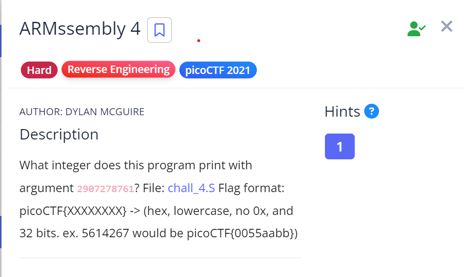

# ARMssembly 4

## Challenge Description

## Approach

**Assembly Code** - [ARMssembly4](./Resources&SourceCodes/ARMssembly4.asm)

Okay so the assembly code for this challenge was too big and lot of it was unnecessary so I'll just briefly explain what we need to do to solve this challenge - 

Argument - 2907278761

1. Main function takes in the argument and calls func1

2. func1 checks if the argument and compares it with the value 100. If argument < 100, it branches to label .L2. If argument > 100, add 100 and branch it to func2.

Therefore, 2907278761 + 100 = 2907278861

3. func2 compares the value with 499. If value > 499, which is true in our case, it branches to label L5

4. At label L5, we add 13 to the value, then calls func5 which later calls func8

    Therefore, 2907278861 + 13 = 2907278874

5. Func8 adds 2 to the value and returns

    Therefore, 2907278874 + 2 = 2907278876

Now we need to convert 2907278876 into hexadecimal -> AD498E1C

## Flag

`picoCTF{AD498E1C}`
