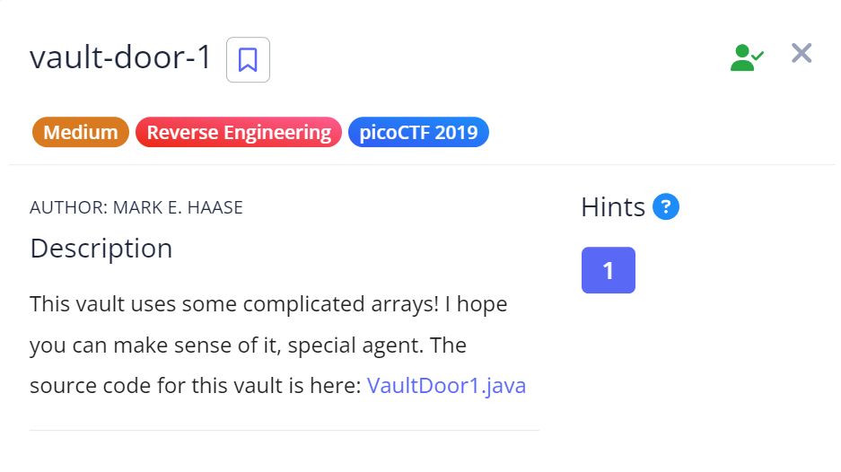

# Vault Door 1

## Challenge Details



**Source Code** - [VaultDoor1.java](./Resources&SourceCodes/VaultDoor1.java)

## Approach

So when I opened the Java souce code, I found a method of boolean type that basically takes in the password String given by the user as a parameter.

```
public boolean checkPassword(String password) {
        return password.length() == 32 &&
               password.charAt(0)  == 'd' &&
               password.charAt(29) == '3' &&
               password.charAt(4)  == 'r' &&
               password.charAt(2)  == '5' &&
               password.charAt(23) == 'r' &&
               password.charAt(3)  == 'c' &&
               password.charAt(17) == '4' &&
               password.charAt(1)  == '3' &&
               password.charAt(7)  == 'b' &&
               password.charAt(10) == '_' &&
               password.charAt(5)  == '4' &&
               password.charAt(9)  == '3' &&
               password.charAt(11) == 't' &&
               password.charAt(15) == 'c' &&
               password.charAt(8)  == 'l' &&
               password.charAt(12) == 'H' &&
               password.charAt(20) == 'c' &&
               password.charAt(14) == '_' &&
               password.charAt(6)  == 'm' &&
               password.charAt(24) == '5' &&
               password.charAt(18) == 'r' &&
               password.charAt(13) == '3' &&
               password.charAt(19) == '4' &&
               password.charAt(21) == 'T' &&
               password.charAt(16) == 'H' &&
               password.charAt(27) == 'f' &&
               password.charAt(30) == 'b' &&
               password.charAt(25) == '_' &&
               password.charAt(22) == '3' &&
               password.charAt(28) == '6' &&
               password.charAt(26) == 'f' &&
               password.charAt(31) == '0';
    }

```

Now this method basically checks if the length of the password given by the user is of size 32 and then it check every index of the password and sees if it matches the particular character that should be in the index of that password.


So if we arrange the indexes of the password's array in ascending order, we can easily get the flag.


We can do this manually but I wanted to try something better and I made a code for this.

[PasswordCharacters.java](./Resources&SourceCodes/PasswordCharacters.java)

So in my code, I'm basically assigning all the positions into the positions and in the characters array, I'm assigning the character associated to position listed at the same index as the positions array.

Then I'm implementing a bubble sort program to swap the positions array and I'm swapping the respective elements of the characters array along with it.

Finally I print the password by using a for-each loop.

`Password`- d35cr4mbl3_tH3_cH4r4cT3r5_ff63b0

## Flag

`picoCTF{d35cr4mbl3_tH3_cH4r4cT3r5_ff63b0}`

