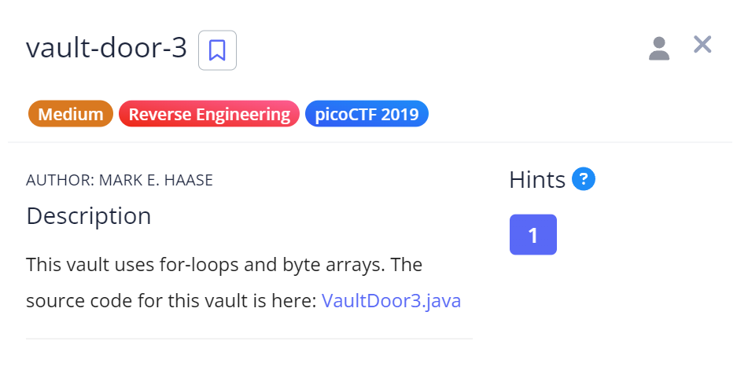

# Vault Door 2 

## Challenge Details



## Approach

When I opened the Java souce code, I found a method called checkPassword of boolean type that basically takes in the password String given by the user as a parameter and returns true if the String matches a target i.e. **"jU5t_a_sna_3lpm18g947_u_4_m9r54f"**

**Source Code** - [VaultDoor3.java](./Resources&SourceCodes/VaultDoor3.java)

``` java
public boolean checkPassword(String password) {
        if (password.length() != 32) {
            return false;
        }
        char[] buffer = new char[32];
        int i;
        for (i=0; i<8; i++) {
            buffer[i] = password.charAt(i);
        }
        for (; i<16; i++) {
            buffer[i] = password.charAt(23-i);
        }
        for (; i<32; i+=2) {
            buffer[i] = password.charAt(46-i);
        }
        for (i=31; i>=17; i-=2) {
            buffer[i] = password.charAt(i);
        }
        String s = new String(buffer);
        return s.equals("jU5t_a_sna_3lpm18g947_u_4_m9r54f");
    }
```

So when I looked into the code there are multiple steps being followed to decrypt the password :-

1. We are first checking if the size of the password entered by the user is 32.If it's not 32, the program will return false.

2. Next we are making a character array called "Buffer" of size 32.

3. Now buffer is broken down in the following ways -
- **First loop** (i=0 to 7): Copies characters directly
- **Second loop** (i=8 to 15) : Copies all the (23-index) character to buffer
- **Third loop** (i=16 to 31, incrementing by 2): Copies all the characters to buffer and increasing the index by 2 after every iteration
- **Fourth loop** (i=31 to 17, stepping by -2): Copies backward from 31st index and decreasing the index by 2 after every iteration.

I wrote the following code to reverse engineer the password.

[PasswordSolver.java](./Resources&SourceCodes/PasswordSolver.java)

From this got the password - `jU5t_a_s1mpl3_an4gr4m_4_u_79958f`

## Flag

`picoCTF{jU5t_a_s1mpl3_an4gr4m_4_u_79958f}`

