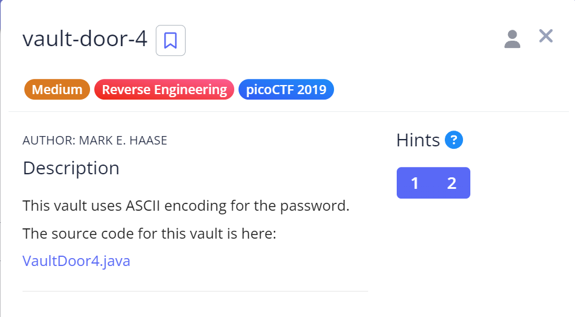

# Vault Door 4

## Challenge Details



## Hints

1. Use a search engine to find an "ASCII table".

2. You will also need to know the difference between octal, decimal, and hexadecimal numbers.

## Approach

Source Code : [VaultDoor4.java](./Resources&SourceCodes/VaultDoor4.java)

So when I opened this program, I found a method called checkPassword of type boolean that returns true if the password entered by the user matches a target value. However the target value is converted to an array and each character is converted into some other value using ASCII encoding.

This following code snippet is the contains the encoded array myBytes:
```
byte[] myBytes = {
            106 , 85  , 53  , 116 , 95  , 52  , 95  , 98  ,
            0x55, 0x6e, 0x43, 0x68, 0x5f, 0x30, 0x66, 0x5f,
            0142, 0131, 0164, 063 , 0163, 0137, 0143, 061 ,
            '9' , '4' , 'f' , '7' , '4' , '5' , '8' , 'e' ,
        };
```

Also the hints mentioned that we need to know the difference between octal, decimal, and hexadecimal numbers. 

So on the basis of these hints, I observed the following :-
- The First row can be `ASCII values converted to character`
- Second row can be `ASCII to hexadecimal`
- Third row was the one that confused me. But then I realised it was `ASCII to Octal`
- The Fourth row already contained the original characters as I noticed all of them were enclosed in `" "`

I passed the byte data into their respective decoding schemes using an Online decoder and got the answer.

Also I couldn't directly convert the Octal to ASCII. Hence, I first converted Octal to Decimal and then Decimal to ASCII.

From this, I got the password: `jU5t_4_bUnCh_0f_bYt3s_c194f7458e`

## Flag

`picoCTF{jU5t_4_bUnCh_0f_bYt3s_c194f7458e}`


