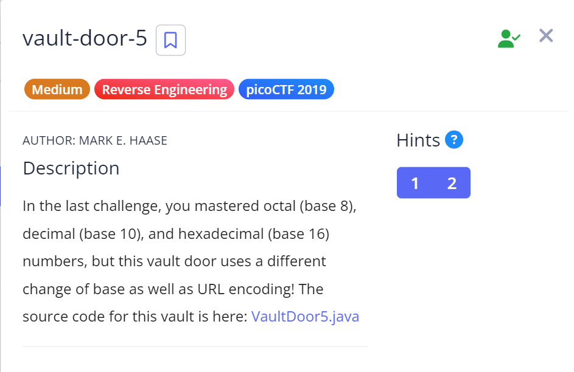

# Vault Door 5

## Challenge Details



## Approach

Source Code : [VaultDoor-5.java](./Resources&SourceCodes/VaultDoor5.java)

When I opened the Java code, I saw that there is a method called `checkPassword` of return type boolean which returns true if the give String value passed as a parameter matches a target value.

``` 
public boolean checkPassword(String password) {
        String urlEncoded = urlEncode(password.getBytes());
        String base64Encoded = base64Encode(urlEncoded.getBytes());
        String expected = "JTYzJTMwJTZlJTc2JTMzJTcyJTc0JTMxJTZlJTY3JTVm"
                        + "JTY2JTcyJTMwJTZkJTVmJTYyJTYxJTM1JTY1JTVmJTM2"
                        + "JTM0JTVmJTY1JTMzJTMxJTM1JTMyJTYyJTY2JTM0";
        return base64Encoded.equals(expected);
    }
```

Now this method first calls the `urlEncode` method and it's output is returned to the String urlEncoded.

Then, it calls the `base64Encode` method and it's output is returned to the String base64Encoded.

Finally, if the base64Encoded value is the same as the String expected value, the checkPassword method will return true.

Before we discuss the decryption process, let's try to understand how the `urlEncode` and `base64Encode` functions work.

`URL Encoding` - URL encoding converts characters into a format that can be transmitted over the Internet. It `replaces unsafe ASCII characters with a "%" followed by two hexadecimal digits`.

`Base64 Encoding` - Base64 is a group of binary-to-text encoding schemes that transforms binary data into a sequence of printable characters, limited to a set of 64 unique characters. 

### URL encoding

```
public String urlEncode(byte[] input) {
        StringBuffer buf = new StringBuffer();
        for (int i=0; i<input.length; i++) {
            buf.append(String.format("%%%2x", input[i]));
        }
        return buf.toString();
    }
```

1. The **urlEncode** method takes in a **byte array** as it's parameters.

2. Then we are defining a variable buf of type StringBuffer. StringBuffer is better than string because it is mutable and thread safe.

3. Then we're taking each character of the byte array using the for loop.

4. Now this is where the real encryption starts : 
- %% produces a literal `%` character (every URL encoded character begins with a "%").
- `%2x` formats the byte as a 2-digit hexadecimal number
- input[i] is the byte being processed


5. Then the code finally converts the StringBuffer to String and returns it

### Base 64 Encoding

``` 
public String base64Encode(byte[] input) {
        return Base64.getEncoder().encodeToString(input);
    }
```

1. The base64Encode function also takes a byte array as input.

2. Java has an inbuilt `Base64 class` under the util package which does Base64 encryption and decryption.

3. The `getEncoder()` method of the base64 class encrypts the given input into base64 format.

4. We are finally returning the Encoded String at the end of the method

### The Decoding Process

So now we know that given input is first converted in URL encoding format and then it is converted into Base64 encoding format during the encryption.

So for the decryption, we do the exact opposite.

1. I took the entire expected String from the program and tried to convert it into URL encoded form using a base64 to ASCII decoder online - https://www.base64decode.org/

.png)

2. Then I fed the resulting output into a URL decoder online - https://www.url-encode-decode.com/

.png)

From this, I successfully got the password - `c0nv3rt1ng_fr0m_ba5e_64_e3152bf4`

## Flag

`picoCTF{c0nv3rt1ng_fr0m_ba5e_64_e3152bf4}`

## References

https://docs.oracle.com/javase/8/docs/api/index.html?java/util/Base64.html

https://www.w3schools.com/tags/ref_urlencode.ASP


