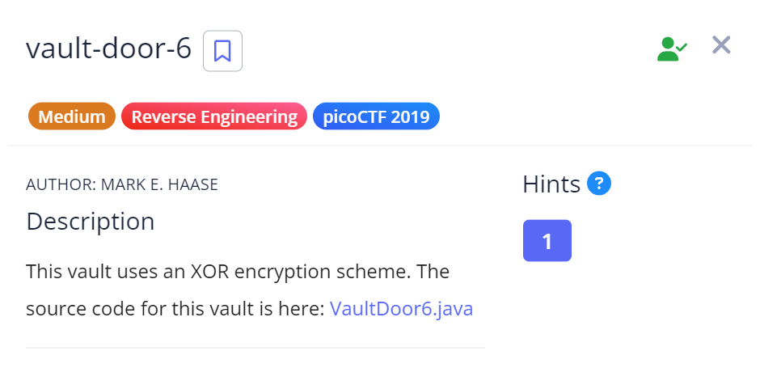

# Vault Door 6

## Challenge Details



## Approach 

**Source Code** - [VaultDoor6.java](./Resources&SourceCodes/VaultDoor6.java)

So just like the previous challenges, here also we have a checkPassword method

``` java
public boolean checkPassword(String password) {
        if (password.length() != 32) {
            return false;
        }
        byte[] passBytes = password.getBytes();
        byte[] myBytes = {
            0x3b, 0x65, 0x21, 0xa , 0x38, 0x0 , 0x36, 0x1d,
            0xa , 0x3d, 0x61, 0x27, 0x11, 0x66, 0x27, 0xa ,
            0x21, 0x1d, 0x61, 0x3b, 0xa , 0x2d, 0x65, 0x27,
            0xa , 0x66, 0x36, 0x30, 0x67, 0x6c, 0x64, 0x6c,
        };
        for (int i=0; i<32; i++) {
            if (((passBytes[i] ^ 0x55) - myBytes[i]) != 0) {
                return false;
            }
        }
```

In this we are again checking if the input has 32 characters.

Then we're converting it into a byte array and `XORing each element of the array with 0x55`

Then we are subracting the XORed value with the myBytes value at that index and if they're equal, then it is the correct password.


To Decrypt this, I wrote the following code :-
[PasswordXORDecrypter.java](./Resources&SourceCodes/PasswordXORDecrypter.java)

The logic I have used here is `when we XOR an already XORed value, we get the same value back` which is something I learnt in my electronics lectures.

From this, I got the password - `n0t_mUcH_h4rD3r_tH4n_x0r_3ce2919`

## Flag

`picoCTF{n0t_mUcH_h4rD3r_tH4n_x0r_3ce2919}`

