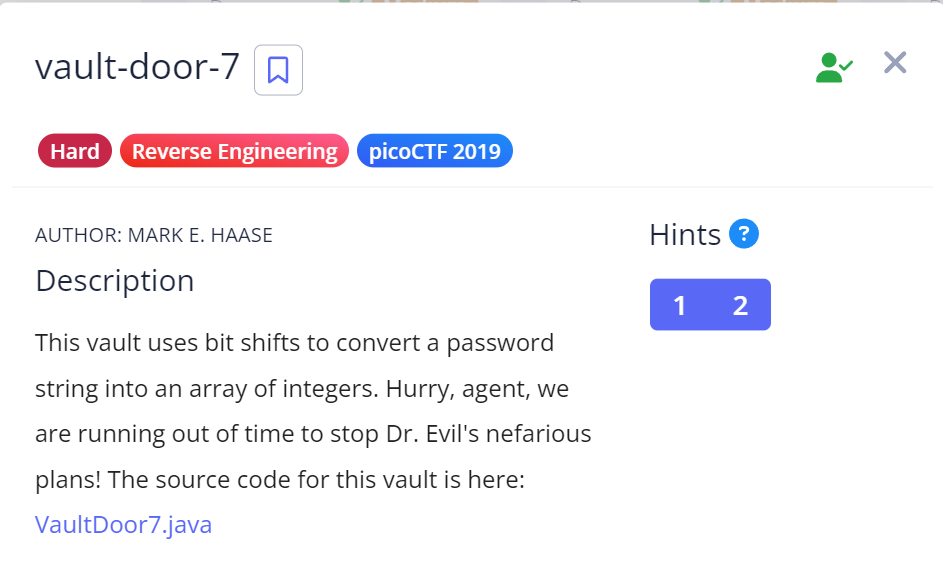

# Vault Door 7

## Challenge Details



## Approach

**Source Code** : [VaultDoor7.java](./Resources&SourceCodes/VaultDoor7.java)

Like the previous levels, we again have the check password method but there's another more important method i.e. the intArray Method :

``` java
public int[] passwordToIntArray(String hex) {
        int[] x = new int[8];
        byte[] hexBytes = hex.getBytes();
        for (int i=0; i<8; i++) {
            x[i] = hexBytes[i*4]   << 24
                 | hexBytes[i*4+1] << 16
                 | hexBytes[i*4+2] << 8
                 | hexBytes[i*4+3];
        }
        return x;
    }

 public boolean checkPassword(String password) {
        if (password.length() != 32) {
            return false;
        }
        int[] x = passwordToIntArray(password);
        return x[0] == 1096770097
            && x[1] == 1952395366
            && x[2] == 1600270708
            && x[3] == 1601398833
            && x[4] == 1716808014
            && x[5] == 1734291511
            && x[6] == 960049251
            && x[7] == 1681089078;
    }
```

Okay so what's happening here is our password need to be 32 characters long.

Then we're running a loop 8 times which does the following :

- If `index mod 4 = 0` - we are left shifting 24 times.

-  If `index mod 4 = 1` - we are left shifting 24 times.

- If `index mod 4 = 2` - we are  left shifting 8 times.

- If `index mod 4 = 3` - No change.

Now the final value gets stored to an array x of size 8.

We have been given the value of X at every index.


Hence to decrypt this, we basically have to do the same logic but instead of `left shift, we use right shift.`

This is code that I wrote which does this operation efficiently :

``` java
class PasswordHexDecrypter {
    public static void main(String[] args) {
        int[] x = {1096770097, 1952395366, 1600270708, 1601398833, 1716808014, 1734291511, 960049251, 1681089078};

        byte[] hexBytes = new byte[32];

        for (int i = 0; i < 8; i++) {
            hexBytes[i * 4] = (byte) (x[i] >> 24);
            hexBytes[i * 4 + 1] = (byte) (x[i] >> 16);
            hexBytes[i * 4 + 2] = (byte) (x[i] >> 8);
            hexBytes[i * 4 + 3] = (byte) x[i];
        }
        
        for(int i=0;i<32;i++){
        System.out.println(hexBytes[i]);
        }
    }
}

```

From this we get the output in the form of integers.

Then I used an online Decimal to ASCII converter to get the password.

.png)

## Flag

`picoCTF{A_b1t_0f_b1t_sh1fTiNg_07990cd3b6}`


