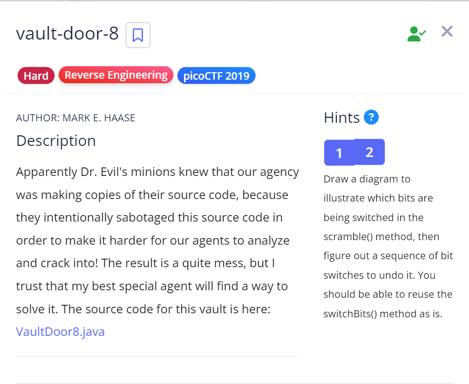

# Vault Door 8

## Challenge Description



## Approach 

First the code was messy so I cleaned it with proper indentation

``` java

// These pesky special agents keep reverse engineering our source code and then
// breaking into our secret vaults. THIS will teach those sneaky sneaks a
// lesson.
//
// -Minion #0891
import java.util.*;
import javax.crypto.Cipher;
import javax.crypto.spec.SecretKeySpec;
import java.security.*;

class VaultDoor8 {
    public static void main(String args[]) {
        Scanner b = new Scanner(System.in); 
        System.out.print("Enter vault password: ");
        String c = b.next(); 
        String f = c.substring(8, c.length() - 1); // Remove "picoCTF{" from the input
        
        VaultDoor8 a = new VaultDoor8(); 
        if (a.checkPassword(f)) {
            System.out.println("Access granted."); 
        } else {
            System.out.println("Access denied!"); 
        } 
    }

    public char[] scramble(String password) {
        /* Scramble a password by transposing pairs of bits. */
        char[] a = password.toCharArray(); 
        for (int b = 0; b < a.length; b++) {
            char c = a[b]; 
            c = switchBits(c, 1, 2); 
            c = switchBits(c, 0, 3); /* c = switchBits(c,14,3); c = switchBits(c, 2, 0); */ 
            c = switchBits(c, 5, 6); 
            c = switchBits(c, 4, 7);
            c = switchBits(c, 0, 1); /* d = switchBits(d, 4, 5); e = switchBits(e, 5, 6); */ 
            c = switchBits(c, 3, 4); 
            c = switchBits(c, 2, 5); 
            c = switchBits(c, 6, 7); 
            a[b] = c; 
        }
        return a;
    }

    public char switchBits(char c, int p1, int p2) {
        /* Move the bit in position p1 to position p2, and move the bit
           that was in position p2 to position p1. Precondition: p1 < p2 */
        char mask1 = (char)(1 << p1);
        char mask2 = (char)(1 << p2); /* char mask3 = (char)(1<<p1<<p2); mask1++; mask1--; */ 
        char bit1 = (char)(c & mask1); 
        char bit2 = (char)(c & mask2); /* System.out.println("bit1 " + Integer.toBinaryString(bit1));
                                       System.out.println("bit2 " + Integer.toBinaryString(bit2)); */ 
        char rest = (char)(c & ~(mask1 | mask2)); 
        char shift = (char)(p2 - p1); 
        char result = (char)((bit1 << shift) | (bit2 >> shift) | rest); 
        return result;
    }

    public boolean checkPassword(String password) {
        char[] scrambled = scramble(password); 
        char[] expected = {
            0xF4, 0xC0, 0x97, 0xF0, 0x77, 0x97, 0xC0, 0xE4, 
            0xF0, 0x77, 0xA4, 0xD0, 0xC5, 0x77, 0xF4, 0x86, 
            0xD0, 0xA5, 0x45, 0x96, 0x27, 0xB5, 0x77, 0xD2, 
            0xD0, 0xB4, 0xE1, 0xC1, 0xE0, 0xD0, 0xD0, 0xE0
        }; 
        return Arrays.equals(scrambled, expected);
    }
}

```

This is my code to reverse engineer this process : [VaultDoor8](./Resources&SourceCodes/VaultDoor8.java)

## Flag

`picoCTF{s0m3_m0r3_b1t_sh1fTiNg_91c642112}`

