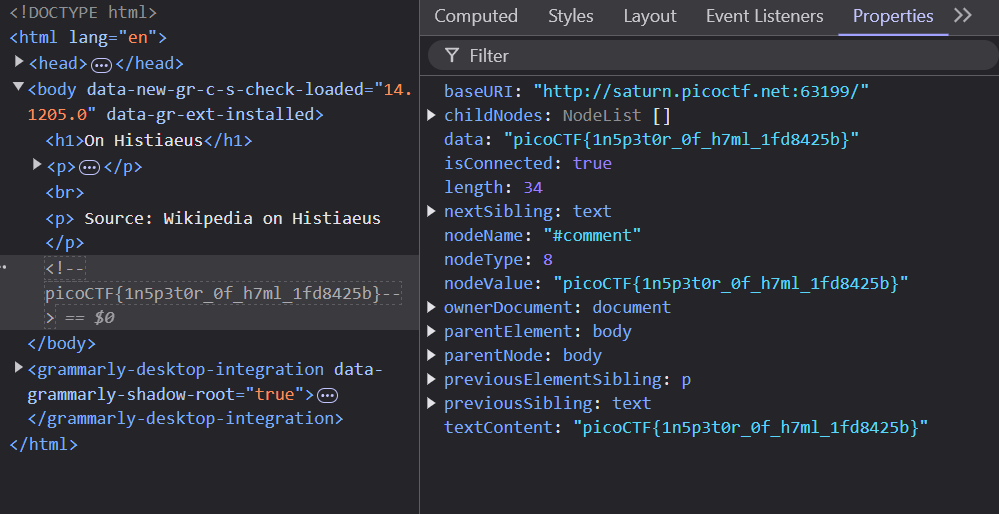

# Inspect HTML

## Challenge Objectives

The objective of this challenge  is to inspect the HTML of a webpage and extract the flag from it.

## Approach

Okay so the first thing the challenge did was  to open a webpage in the browser. 

It was a simple HTML webpage and there wasn't avny useful text from the look of it.

I decided to use the inspect element to view  the webpage's source code and maybe find something useful in it.

I expanded a found that the flag was wrapped in a comment. I extracted the flag from the comment and submitted it as the answer.

**HTML Comments** - `<!-- ... -->`

## Flag

`picoCTF{1n5p3t0r_0f_h7ml_1fd8425b}`

