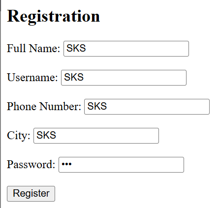
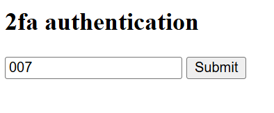
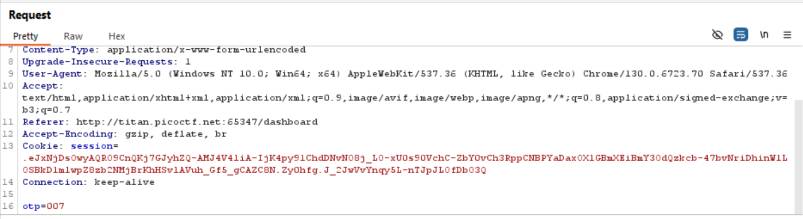
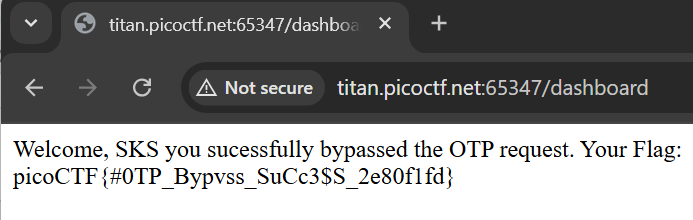

# Intro To Burp

## Hints

1. Try using burpsuite to intercept request to capture the flag.

2. Try mangling the request, maybe their server-side code doesn't handle malformed requests very well.

## Challenge Objectives

The objective of this challenge  is to learn how to intercept HTTPS requests on Burpsuite which is a powerful tool for web application security testing.

## Approach

So after opening the website, I saw that the webpage was asking the user for a username, password and some other fields. 

Burpsuite is basically a web application security testing tool that can intercept and modify HTTP requests. One can think of Burpsuite as a **"Man-in-The-Middle"** for handiling web applications.

To Intercept the HTTPS request, I opened the Burpsuite in-built Chromium browser and pasted the URL of the webpage in the address bar. Then I switched ON the intecept button on Burpsuite.

Now I opened up a new project on my Bursuite and started the proxy server. I then navigated back to the webpage and entered some dummy credentials. 

I then used the **"Forward"** button to send the intercepted request to the server. 

After that, I reached a page asking for an "OTP".

Then I again sent a dummy OTP and clicked on the submit button. This is what my requests page looked like on Burpsuite.

I saw that there was a parameter called "OTP" in the request. I tried to mangle the request by completely removing the "OTP" parameter from the request. I then clicked on the "Forward" button to send the request to the server.

By doing this, I successfully obtained the flag.

## Flag

`picoCTF{#0TP_Bypvss_SuCc3$S_2e80f1fd}`

