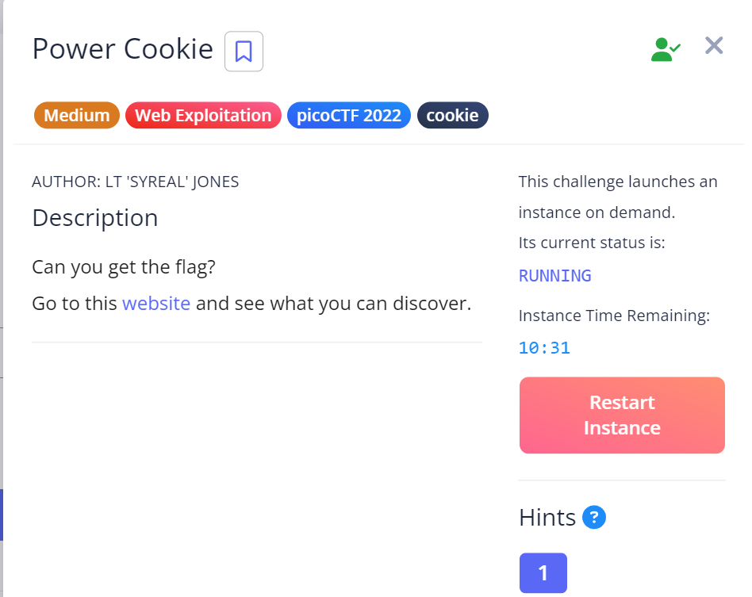

# Power Cookies

## Challenge Goals

## Hint

1. Do you know how to modify cookies?

## Approach

Webpage Link : http://saturn.picoctf.net:59045/check.php

So when I enetered the webpage, I saw there was nothing apart from a button that said "Continue as Guest" and when I clicked it, I was redirected to a page which said "We don't have guest services".

As always, I decided to go through the source code and inner working of the page using the inspect element.

Based on the hint given by the challenge, I figured it was something related to cookies.

Now I had done something similar in the OASIS CTF as well for the PacMan challenge. I went to the Applications tab of the inspect element and expanded the cookies bar.

There I found a cookie called "IsAdmin" whose value was "0". I changed it's calue to 1 and got the flag.

## Flag

`picoCTF{gr4d3_A_c00k13_0d351e23}`

## My Learning

Through this challenge, I learnt how to modify and play with cookies using the Inspect Element.