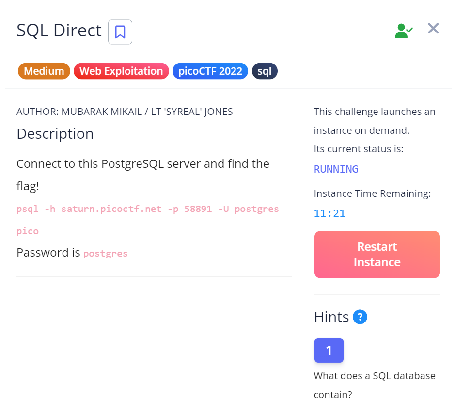

# SQL Direct

## Challenge Details



## Hints

1. What does a SQL database contain?

## Approach

PostgreSQL is a very widely used open-source relational database management system(RDBMS).

I followed this video to install PostgreSQL on my system : https://www.youtube.com/watch?v=UGfteFq_6Co

I used the following command to connect to PostgreSQL server : `psql -h saturn.picoctf.net -p 57004 -U postgres pico`

`psql` -  This is the command-line client for PostgreSQL. It allows you to connect to and interact with PostgreSQL databases.

`-h` -  The -h option specifies the hostname or IP address of the database server. Here, it’s set to saturn.picoctf.net

`-p 57004` - Port specifier connected to port number 57004

`-U postgres` - The -U option specifies the username to use for connecting to the database. In this case, it is postgres, which is the default administrative user in PostgreSQL.

`pico `: Name of the database

I entered the password given to me when launching the instance of the challenge: **postgres**

``` sql
Type "help" for help.

pico=# help
You are using psql, the command-line interface to PostgreSQL.
Type:  \copyright for distribution terms
       \h for help with SQL commands
       \? for help with psql commands
       \g or terminate with semicolon to execute query
       \q to quit
```

This is what I saw after logging in and I gave the command "help".

Then I tried to look for the appropriate psql command with `\?` flag.

Now I was actually stuck here for a while and trying to find the right command to proceed.

I first thought of using the `\p` command to show the contents of the query.
```
pico=# \p
Query buffer is empty.
```
However this did not work as I am not giving a query and not searching for the flag in any flag.

Then I looked at the hint and wondered what it could be.

I realised that a database essentially contains information in the form of `tables` like in an excel sheet.

I found the `\d` command which basically lists tables in the database.

``` 
pico-# \d
         List of relations
 Schema | Name  | Type  |  Owner
--------+-------+-------+----------
 public | flags | table | postgres

 ```

 This then gave me a table and I was getting somewhere as I saw that there is a table called `flags`.

 Now all I had to figure out was how to read the contents of this table.

 After some Googling, I learnt that there is a command called `SELECT` which as it's name suggest, selects data from a database.

Then I gave the following prompt to the psql 

``` 
pico=# SELECT * FROM flags;
 id | firstname | lastname  |                address
----+-----------+-----------+----------------------------------------
  1 | Luke      | Skywalker | picoCTF{L3arN_S0m3_5qL_t0d4Y_31fd14c0}
  2 | Leia      | Organa    | Alderaan
  3 | Han       | Solo      | Corellia
(3 rows)
```

`SELECT * FROM flags;`

`*` - Selects all columns

`FROM` - Specifies the table 

From this I successfully got the flag.

## Flag

`picoCTF{L3arN_S0m3_5qL_t0d4Y_31fd14c0}`

## My Learning


## References

https://www.w3schools.com/sql/sql_select.asp
