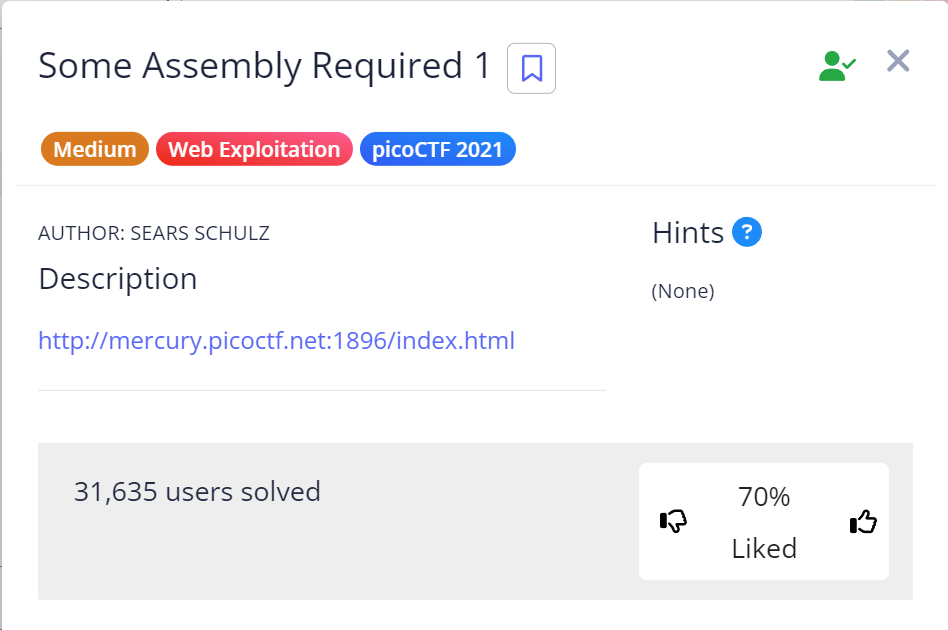

# Some Assembly Required 1

## Challenge Details

## Approach

Webpage : http://mercury.picoctf.net:1896/index.html

Alright so I first tried to look through the source code of the webpage but there wasn't anything useful in it.

Then I later used Inspect element and went to the Sources page.

The Sources panel is used to view and edit a website's resources, such as stylesheets, Javascript files, and images.

Now the name of the challenge suggested that there must be something similar to web assembly and from this knowledge I found a folder called `wasm` which stands for web assembly.

.png)

And after opening the folder, I found code written in Web Assembly language.On scrolling down, I found the flag.

.png)

## Flag

`picoCTF{a2843c6ba4157dc1bc052818a6242c3f}`
