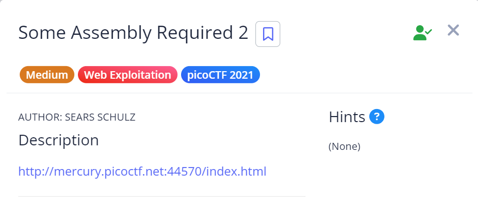

# Some Assembly Required 2

## Challenge Details



## Approach

Webpage link : http://mercury.picoctf.net:23511/index.html

So when I opened the link, I was transported to a webpage and I used inspect element to go through it's underlying code :

.png)

In the sources page I found to folders : one containing a `Javascript` code and the other containing `wasm` code.

Now since this challenge is somewhat related to WebAssembly I opened the web assembly code.

I found that there were mainly 3 functions in it :

1. `(func $strcmp (;1;) (export "strcmp") (param $var0 i32) (param $var1 i32) (result i32)`

The strcmp function takes to 32 bit integer bit numbers (i32) as parameters and returns another 32 bit integer into the Stack.

2. `(func $check_flag (;2;) (export "check_flag") (result i32)`

The check_flag function also return a 32 bit integer

3. `(func $copy_char (;3;) (export "copy_char") (param $var0 i32) (param $var1 i32)`

The copy_char function only takes 2 integers as parameters.


This was basically the baseline of the wasm file.

I looked through the Javascript file for some clue and noticed that `it only exports the copy_char function` :

``` js

function onButtonPress() {
    const _0x50ea62 = _0x5c00;
    let _0x5f4170 = document[_0x50ea62(0xd8)](_0x50ea62(0xda))[_0x50ea62(0xc5)];
    for (let _0x19d3ca = 0x0; _0x19d3ca < _0x5f4170['length']; _0x19d3ca++) {
        exports[_0x50ea62(0xc4)](_0x5f4170[_0x50ea62(0xd1)](_0x19d3ca), _0x19d3ca);
    }
    exports['copy_char'](0x0, _0x5f4170[_0x50ea62(0xd7)]),
    exports[_0x50ea62(0xca)]() == 0x1 ? document['getElementById'](_0x50ea62(0xd3))[_0x50ea62(0xd0)] = _0x50ea62(0xce) : document[_0x50ea62(0xd8)](_0x50ea62(0xd3))['innerHTML'] = _0x50ea62(0xd5);
}

```
From this, I got the intuition that the encryption must only be happening in the copy_char function.

Now I went back to the wasm file and I found that there was an `XOR` function being implemented:

`i32.xor`

To understand this better, I asked ChatGPT to explain how this function works and does the XORing.

I found out that the function basically `XORs the plaintext characters with 8`.

Then I opened an online decoder to reverse the XOR and get the flag - https://gchq.github.io/CyberChef/#recipe=XOR_Brute_Force(1,100,0,'Standard',false,true,false,'pico')&input=eGFrZ0tcNWNOcz48bTppMT4xOTkxOm5ramw8aWkxajBuPW1tMDk7PGk6dVwwMFwwMA

.png)

I found a result that almost matches with the flag format of picoCTF flags and after correcting it, the flag worked.

.png)

## Flag

`picoCTF{64e2a9691192fcbd4aa9b8f5ee8134a2}T88T88`

## My Learning

Through this challenge, I learn the basics of WebAssembly such as modules, functions, the stack etc.

Some basic terminologies and syntax that I learnt -

`( func <signature> <locals> <body> )`
 
- Signature - Declares what the function takes and returns 
- Locals - are like vars in JavaScript
- Body - linear list of low-level instructions


The number types are:
- i32 - 32 bit integer
- i64 - 64 bit integer
- f32 - 32 bit float
- f64 - 64 bit float

- `local.get` is defined to push the value of the local it read onto the stack
- `i32.add` pops two i32 values (it implicitly grabs the previous two values pushed onto the stack), computes their sum (modulo 2^32) and pushes the resulting i32 value.
- `drop` - removes and pops a value

## References

https://developer.mozilla.org/en-US/docs/WebAssembly/Understanding_the_text_format

https://www.youtube.com/watch?v=oHz3_52SUZ0

