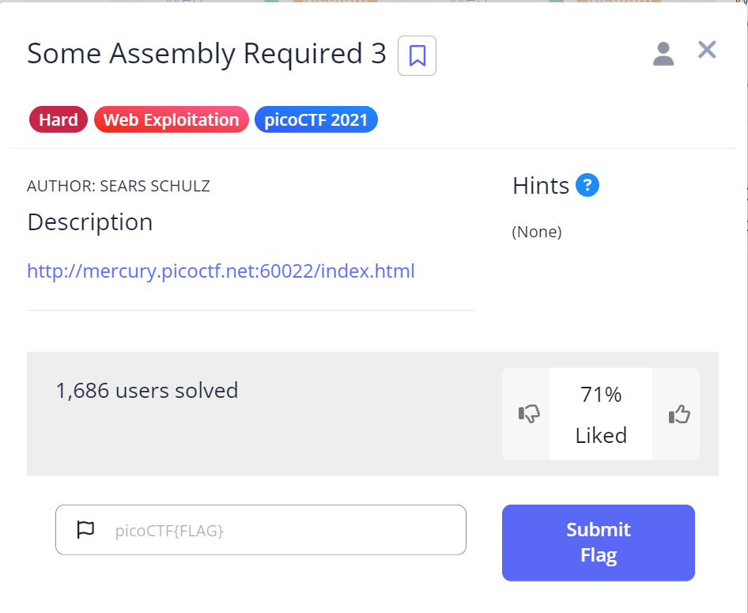

# Some Assembly Required 3

## Challenge Details



## Approach

Okay so this time, instead of manually reading through such lenghty lines of code in WASM format, I discovered the `wabt` toolkit which decompiles web assembly programs.

This challenge is similar to the previous one but we have 2 strings this time:

1. `\9dn\93\c8\b2\b9A\8b\c5\c6\dda\93\c3\c2\da?\c7\93\c1\8b1\95\93\93\8eb\c8\94\c9\d5d\c0\96\c4\d97\93\93\c2\90\00\00`

2. `\f1\a7\f0\07\ed`

I downloaded it by installing cmake and cloning the appropriate github link:

- `sudo install cmake`

- `git clone --recursive https://github.com/WebAssembly/wabt`

Then I decompiled the wasm file on my Ubuntu :

` wasm-decompile 371a51fe.wasm`

Now just like the previous level, the only important function in this is the copy function and here is the code snippet of it:

```

function copy(a:int, b:int) {
  var c:int = g_a;
  var d:int = 16;
  var e:int_ptr = c - d;
  e[3] = a;
  e[2] = b;
  var f:int = e[3];
  if (eqz(f)) goto B_a;
  var g:int = 4;
  var h:int = e[2];
  var i:int = 5;
  var j:int = h % i;
  var k:ubyte_ptr = g - j;
  var l:int = k[1067];
  var m:int = 24;
  var n:int = l << m;
  var o:int = n >> m;
  var p:int = e[3];
  var q:int = p ^ o;
  e[3] = q;
  label B_a:
  var r:int = e[3];
  var s:byte_ptr = e[2];
  s[1072] = r;
}

```

Now some parts of the code are actually not useful and is unnecessary so I'm just going to get to the important parts of it :

- The copy function takes 2 integers (a & b). The important think to understand here is `a is character` and `b is the index`.

- `var j:int = h % i;` : so here h is the index or "b" and i is the constant value 5
We are basically doing `index mod 5`

- `var k:ubyte_ptr = g - j;` : g is 4 and we found j is the previous step. Essentially it is `4 - (index mod 5)`

- `var q:int = p ^ o;` : p is character here or "a" and o is simply k(idk why but they have unnecessarily done a left shift and then a right shift immediately). So it is basically `char xor ((index mod 5))`


So now to decrypt it, we have to reverse it.
Now I wrote the following script in Python to decrypt it.

```
string = "\x9dn\x93\xc8\xb2\xb9A\x8b\xc5\xc6\xdda\x93\xc3\xc2\xda?\xc7\x93\xc1\x8b1\x95\x93\x93\x8eb\xc8\x94\xc9\xd5d\xc0\x96\xc4\xd97\x93\x93\xc2\x90"

key = "\xf1\xa7\xf0\x07\xed"

for i in range(len(string)):
    print(chr(ord(string[i])^ord(key[4-i%5])), end = "")

```

Also I had to put an `"x"` before every `"\"` in the string to make it python readable.

From this I got the flag - `picoCTF{b70fcd378740f6e4bce8388c01540c43}`

## Flag

`picoCTF{b70fcd378740f6e4bce8388c01540c43}`

## My Learning

1. How to decompile wasm files using wabt toolkit

2. How and read decompiled wasm files

## References

https://github.com/WebAssembly/wabt

Some help from ChatGPT to generate the correct code.