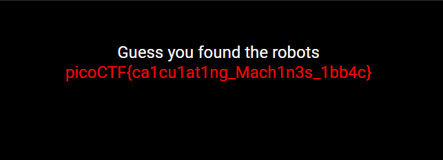

# Where are the robots

## Challenge Details

## Hints

1. What part of the website could tell you where the creator doesn't want you to look?

## Approach 

Webpage Link : https://jupiter.challenges.picoctf.org/problem/56830/

This is what the webpage looked like when I opened it.

Okay so from the hint of this level and the name of the challenge, I figured out that I have to use `robots.txt` to get the flag.

I remember that we had to use `robots.txt` for the "Optimus Prime" challenge of the OASIS CTF and since I had already used it before I got the intuition that I need to use it here as well.

So what does "robots.txt" exactly do?

Robots.txt is basically a `plaintext file(.txt)` to understand `what a website can access` and `where a website can be accessed`.

A robots.txt file lives at the **root** of your site. So, for site `www.example.com`, the robots.txt file lives at `www.example.com/robots.txt`.

I can read the robots.txt file by simply appending a `/robots.txt` to the address of the webpage.

**Address** - https://jupiter.challenges.picoctf.org/problem/56830/robots.txt

Now this is what the robots.txt file looked like:

`User Agent : *` - The asterisk (*) is a wildcard that represents all web crawlers. This means that the following rules apply to all automated agents or bots that visit the site.

`Disallow: /`- The forward slash (/) indicates the root directory of the website. By disallowing this path, the website is instructing all web crawlers not to access any part of the site.

And tada, from this we can see the path `/1bb4c.html` has been blocked.

I add this path to the original website link and retrieve the flag.

## Flag

`picoCTF{ca1cu1at1ng_Mach1n3s_1bb4c}`

