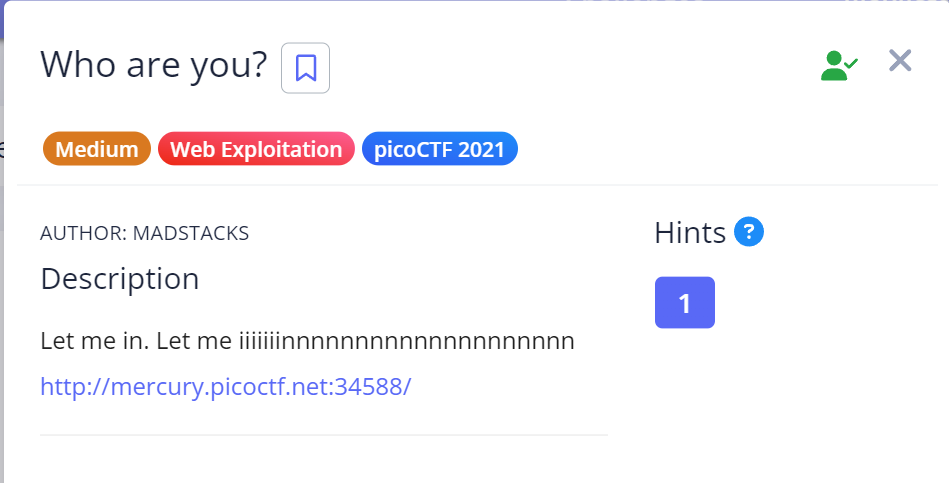
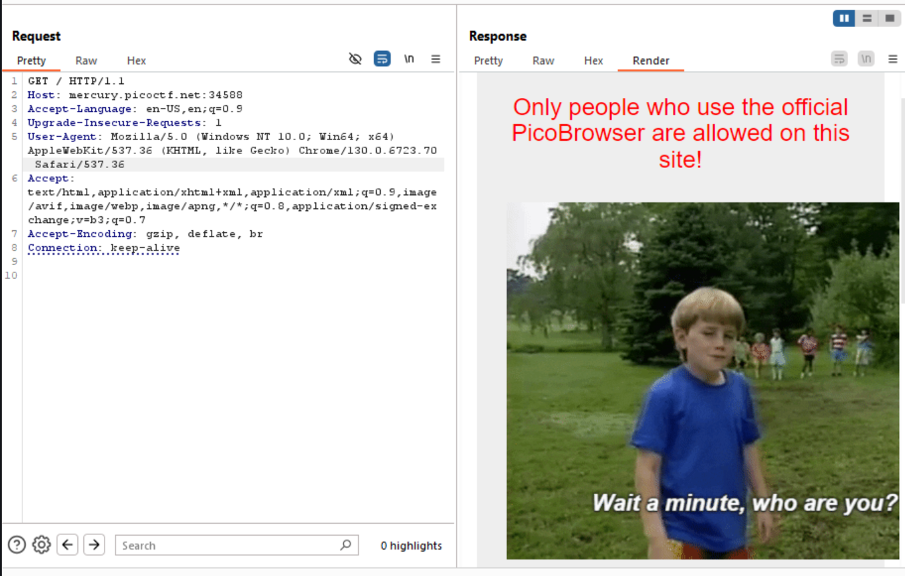
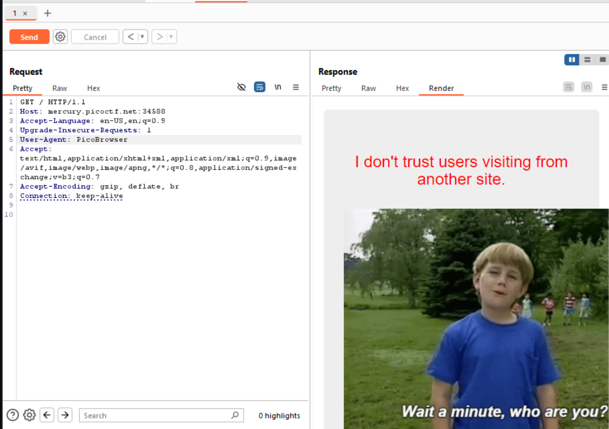
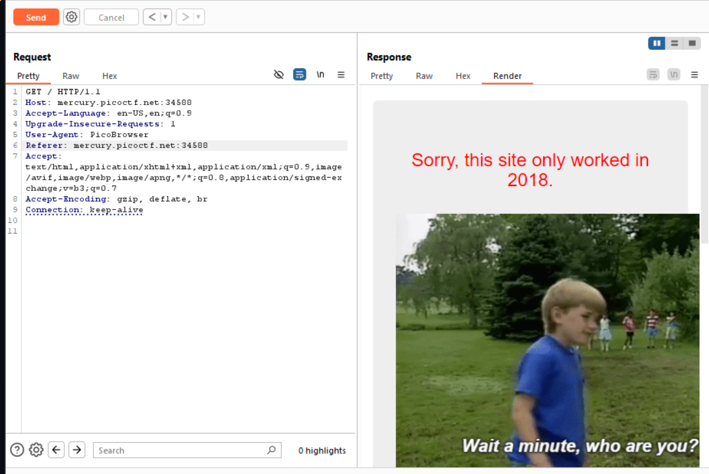
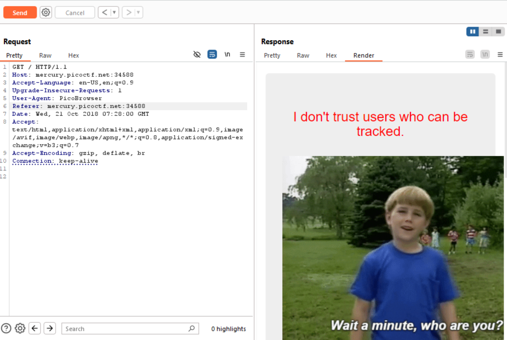
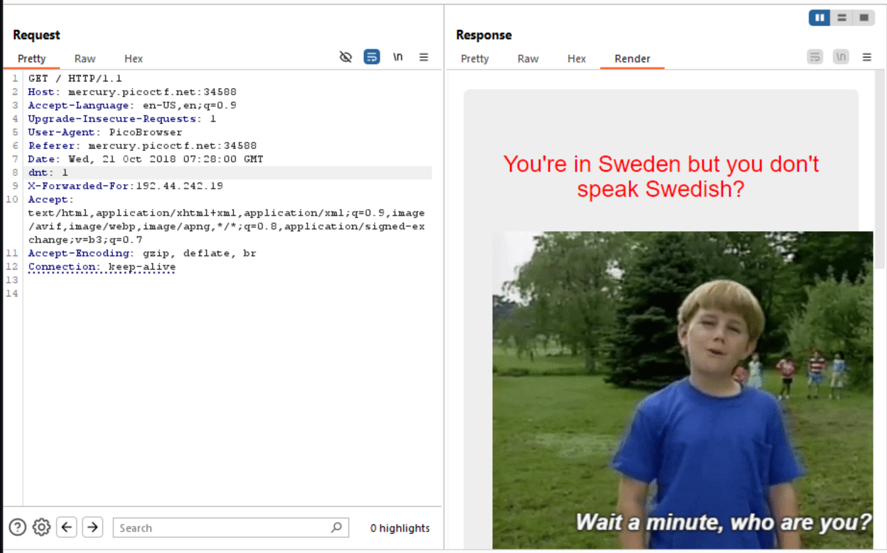
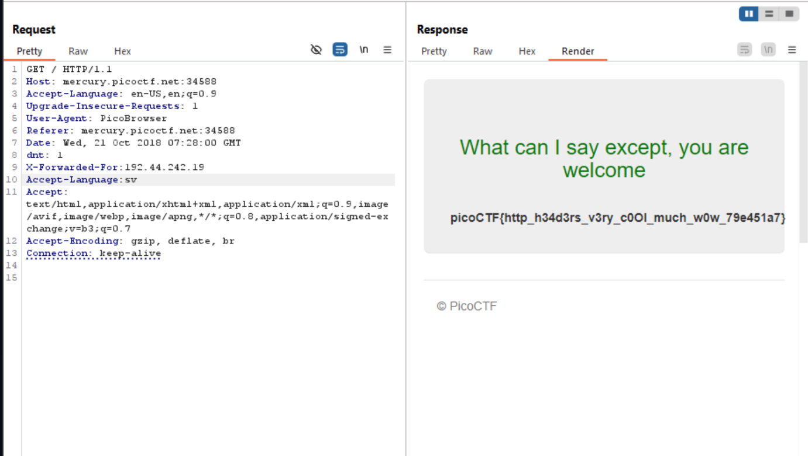

# Who Are You

## Challenge Details

## Hint

1. It ain't much, but it's an RFC https://tools.ietf.org/html/rfc2616

## Approach

Website Link : http://mercury.picoctf.net:34588/

The first thing I did was intercept the website using Burpsuite.

Then I used `Ctrl+R` to open the repeater.

This is what it looked like :

1. From this, I figured out that we need to change the `User Agent : PicoBrowser`

Okay so I was actually stuck here for a lot time as I didn't know how to change the website from where we're referring.

Then after a lot of Googling, I found this thing called the `Referer` which identifies the addresses of web pages.

So I set `Referer:mercury.picoctf.net:34588` which is the address of the site without the HTTPs header

For this I referred to MDN Date headers and copied one of their examples and changed the year to 2018

`Date: Date: Wed, 21 Oct 2018 07:28:00 GMT`

Now this one was the one that took me the longest to figure out.

These are following attempts that I tried and failed:

1. I tried making a location header and did not give it any value `Location:   `

    *(Also I later found out that location refers to the URL to redirect a page to.)*

2. I tried to use the `X-Forwarded-For` header and gave a fake IP address.

3. I thought that even Cookies are used to track users so it may be something related. However, I couldn't find any cookies either

Finally I came across `dnt` which stands for `do not track`.

If we set `dnt : 1` it will not track the user

For this, I found an IP address from Sweden and set it to `X-Forwarded-For: 192.44.242.19`

And for this, I Googled the Language header for Sweden which is sv.

`Accept-Language: sv`

And Hooray, I finally got the flag

## Flag

`picoCTF{http_h34d3rs_v3ry_c0Ol_much_w0w_79e451a7}`

## My Learning

- Using the Repeater in Burpsuite
- Headers such as `User-Agent, Referer, Date, dnt, X-Forwarded-For etc`

## References

https://developer.mozilla.org/en-US/docs/Web/HTTP

https://portswigger.net/burp/documentation/desktop/testing-workflow/access-controls/using-match-and-replace

