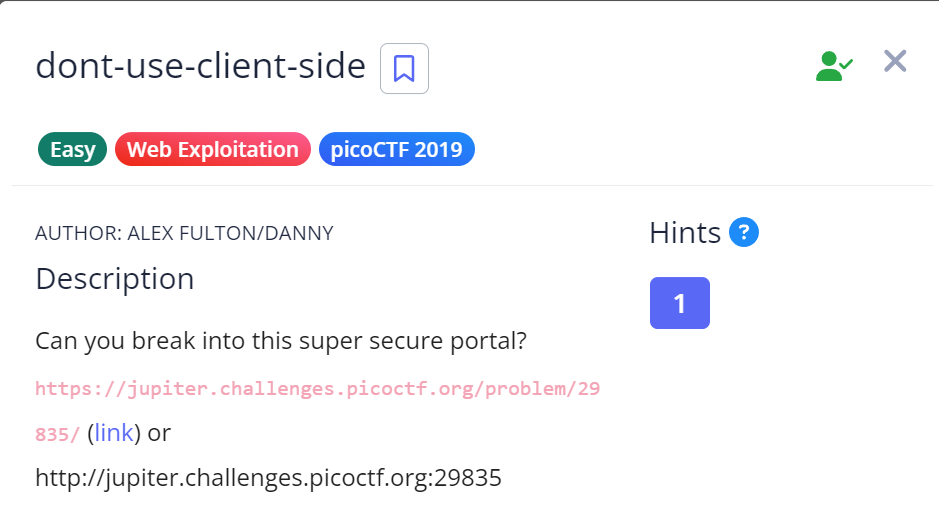

# Don't Use Client Side

## Challenge Details



## Approach

Webpage Link : https://jupiter.challenges.picoctf.org/problem/29835/

So I opened the website and saw that I needed to enter valid credentials to log in.

The first intuition I had was to go through the source code of the webpage using Ctrl-U.

Then I found a javascript function which seemed to be useful :

``` 
function verify() {
    checkpass = document.getElementById("pass").value;
    split = 4;
    if (checkpass.substring(0, split) == 'pico') {
      if (checkpass.substring(split*6, split*7) == '723c') {
        if (checkpass.substring(split, split*2) == 'CTF{') {
         if (checkpass.substring(split*4, split*5) == 'ts_p') {
          if (checkpass.substring(split*3, split*4) == 'lien') {
            if (checkpass.substring(split*5, split*6) == 'lz_7') {
              if (checkpass.substring(split*2, split*3) == 'no_c') {
                if (checkpass.substring(split*7, split*8) == 'e}') {
                  alert("Password Verified")
                  }
                }
              }
      
            }
          }
        }
      }
    }
    else {
      alert("Incorrect password");
    }
```

I noticed that this function contained a few elements of the flag format like : `"pico"` and `"CTF{"`.

Now I had to connect the dots and try to build the flag from these split up pieces.

After doing some research, this is what I understood from the code :-

1. `Verify Function` - checks if a specific password entered by the user matches a predetermined format

2. `Retrieve Input` - 
```
checkpass = document.getElementById("pass").value;
```

`document.getElementById` - Used to access an HTML element by its unique id attribute. In this case, it searches for an element with the id attribute set to "pass".

`.value` property of an HTML input element retrieves the current text that a user has entered in the input field.

The retrieved value is assigned to the variable checkpass.

3. `Password Segment Checks`:

The function then checks each segment of checkpass by slicing strings with substring:
```
if (checkpass.substring(0, split) == 'pico') {

```

I arranged the each of the if conditions on the basis of where they're slicing the index i.e. `(0,split) -> (split,split*2) -> (split*2,split*3) .... till (split*7,split*8)`.

By joining the values, I got the following flag

`picoCTF{no_clients_plz_7723ce}`

## Flag

`picoCTF{no_clients_plz_7723ce}`


